# Commercial Fashion Visual Production

*以商品真实性、视觉一致性与商业交付为核心的 AI-assisted Fashion Visual Production Case Study。*

  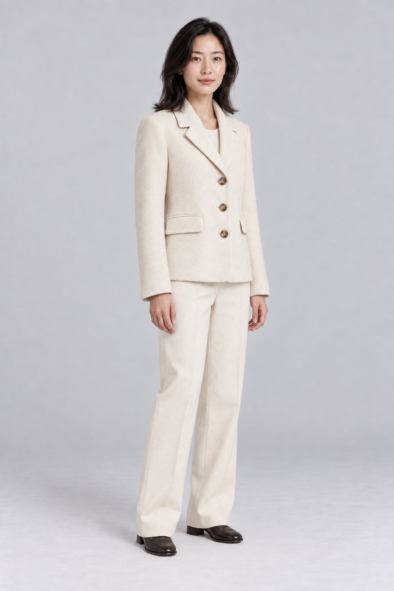

  <a href="https://commercial-visual-production.prime-coati-6409.chatgpt.site">View Live Portfolio</a>
  &nbsp;&nbsp;·&nbsp;&nbsp;
  <a href="./08_CASE_STUDY/PAGE_PLAN.md">View Case Study</a>

## Project Overview

这是一个面向「商品视觉制作（AI修图 / AIGC方向）」岗位的商业视觉项目。项目围绕一款女式短款羊毛混纺外套，建立从 Ground Truth、商品图、模特应用、AI Retouching、Visual QC 到多渠道交付的完整流程。目标不是单纯生成漂亮图片，而是在提高生产效率的同时，持续保持商品颜色、版型、结构与面料特征的一致性。

> **Product truth over visual effect.**

## Final Visuals

以下图片均来自最终 QC-PASS 资产池。

<table>
  <tr>
    <td width="50%">
      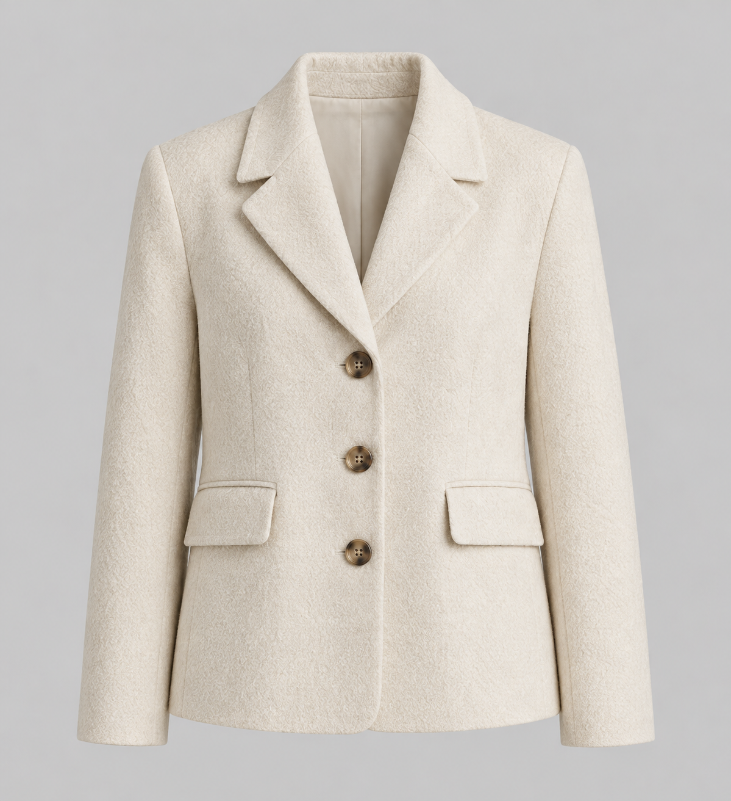
    </td>
    <td width="50%">
      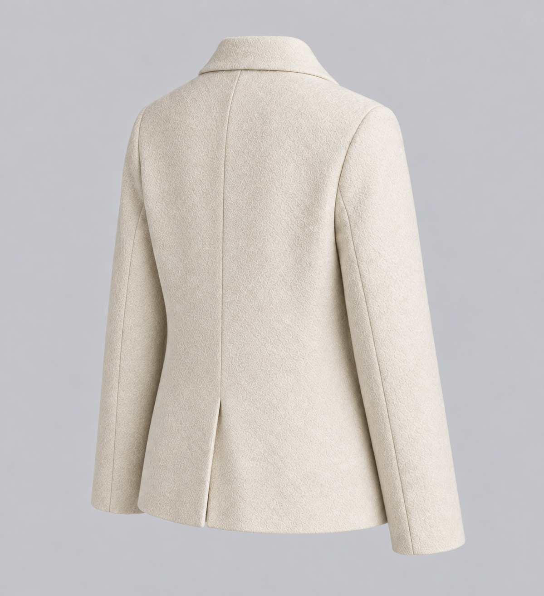
    </td>
  </tr>
  <tr>
    <td align="center">Product Front · PASS</td>
    <td align="center">Product 3/4 Back · PASS</td>
  </tr>
  <tr>
    <td>
      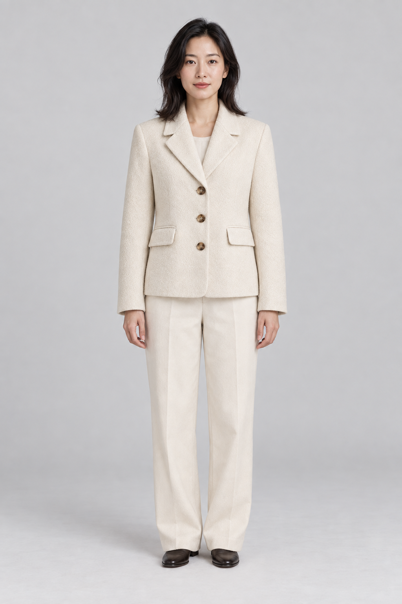
    </td>
    <td>
      
    </td>
  </tr>
  <tr>
    <td align="center">Front Full Body · PASS</td>
    <td align="center">3/4 Full Body · PASS</td>
  </tr>
  <tr>
    <td>
      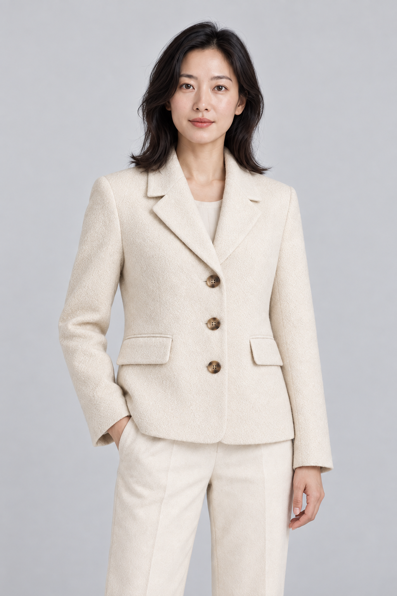
    </td>
    <td>
      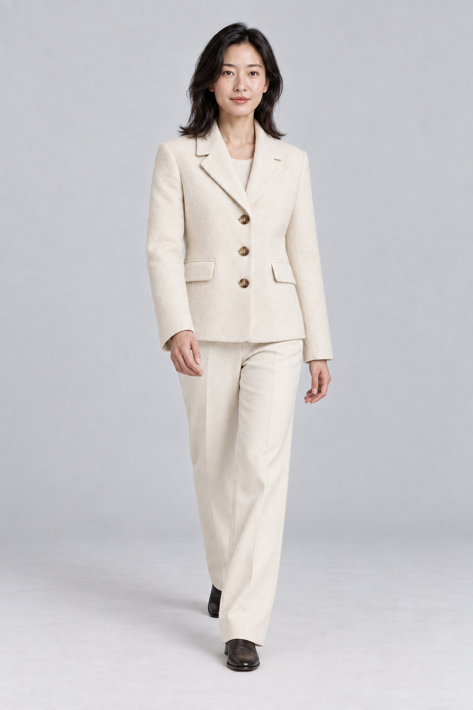
    </td>
  </tr>
  <tr>
    <td align="center">Mid Shot · PASS</td>
    <td align="center">Natural Walk · PASS</td>
  </tr>
</table>

姿势、景别和构图可以变化，商品的衣长、领型、纽扣、口袋和面料特征必须保持一致。

## Production Workflow

**Ground Truth**  
→ **Product Assets**  
→ **Model Application**  
→ **E-commerce / Lifestyle / Editorial**  
→ **AI Retouching**  
→ **Visual QC**  
→ **Multi-format Delivery**

Generative AI was used for image production and controlled editing, while human direction governed product specifications, reference control, consistency checks, and final QC decisions.

只有通过 QC 的素材才能进入下一阶段及最终交付。

## Ground Truth & Product Lock

  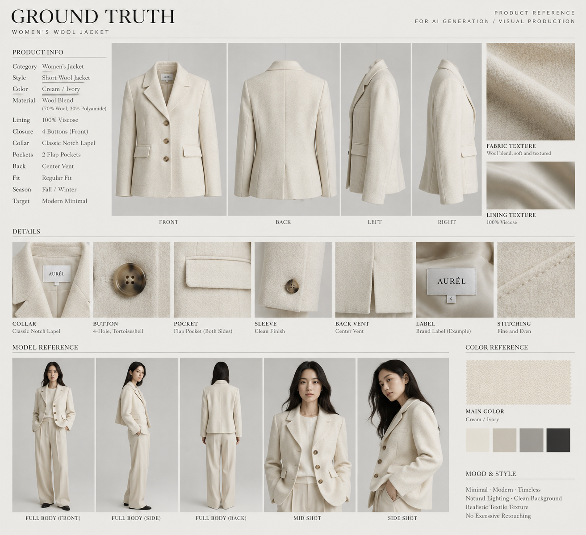

Ground Truth 建立原始视觉依据。根据后续明确的商品设定，前襟纽扣数量最终锁定为 **3 颗**，并应用于所有正式资产。

| Locked Feature | Production Standard |
|---|---|
| Color | Cream / Ivory，不允许明显色彩漂移 |
| Silhouette | 短款、Regular Fit、轻微收腰 |
| Closure | 恰好 3 颗暖棕色四孔仿玳瑁纽扣 |
| Pockets | 恰好 2 个腰部水平翻盖口袋 |
| Fabric | 细密、不规则、哑光的羊毛混纺纹理 |

完整商品规范见 [`PRODUCT_SPEC.md`](./PRODUCT_SPEC.md)。

## AI-assisted Retouching

Retouching 的目标是改善图片呈现，而不是重新设计商品。

<table>
  <tr>
    <th width="50%">BEFORE</th>
    <th width="50%">AFTER · PASS</th>
  </tr>
  <tr>
    <td>
      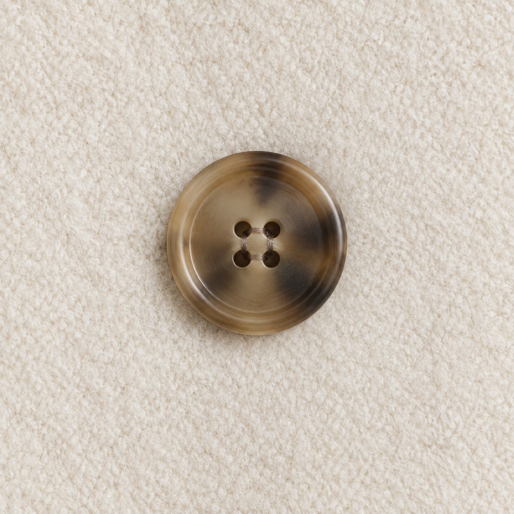
    </td>
    <td>
      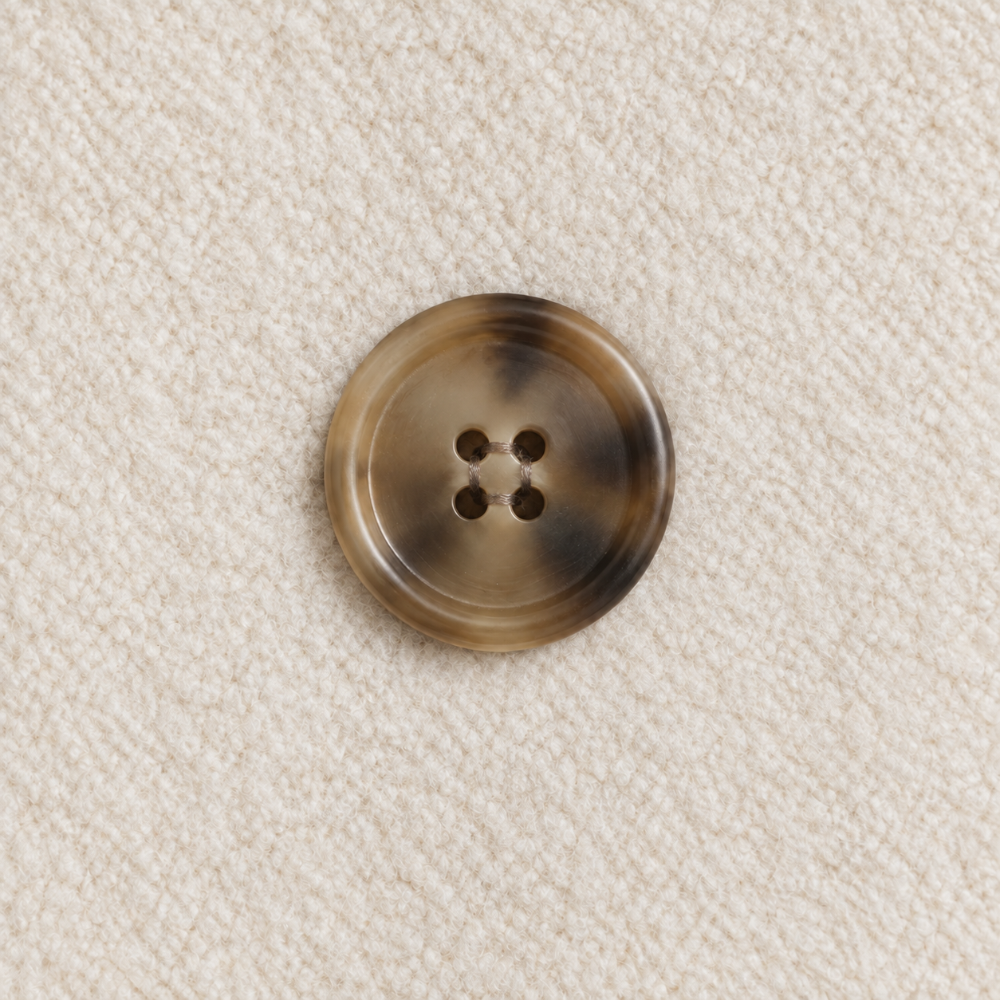
    </td>
  </tr>
</table>

在 Background Cleanup 过程中，纽扣形状、四孔结构、缝线、颜色和面料尺度均保持不变。

AI 可以处理已经确认的视觉问题，但不能重新解释商品结构、增加不存在的细节，或在信息不确定时自行补全。

## Visual QC

每张候选图均与 `PRODUCT_SPEC.md` 和已通过 QC 的 Product Assets 对比，检查：

**Color · Silhouette · Proportion · Lapel · Buttons · Pockets · Fabric · Stitching**

### Button-count Hallucination

<table>
  <tr>
    <th width="33%">GROUND TRUTH</th>
    <th width="33%">AI OUTPUT · REJECT</th>
    <th width="33%">CORRECTED · PASS</th>
  </tr>
  <tr>
    <td>
      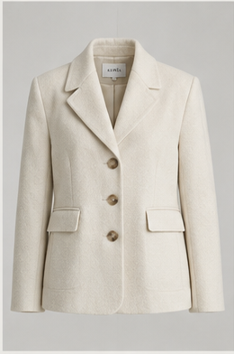
    </td>
    <td>
      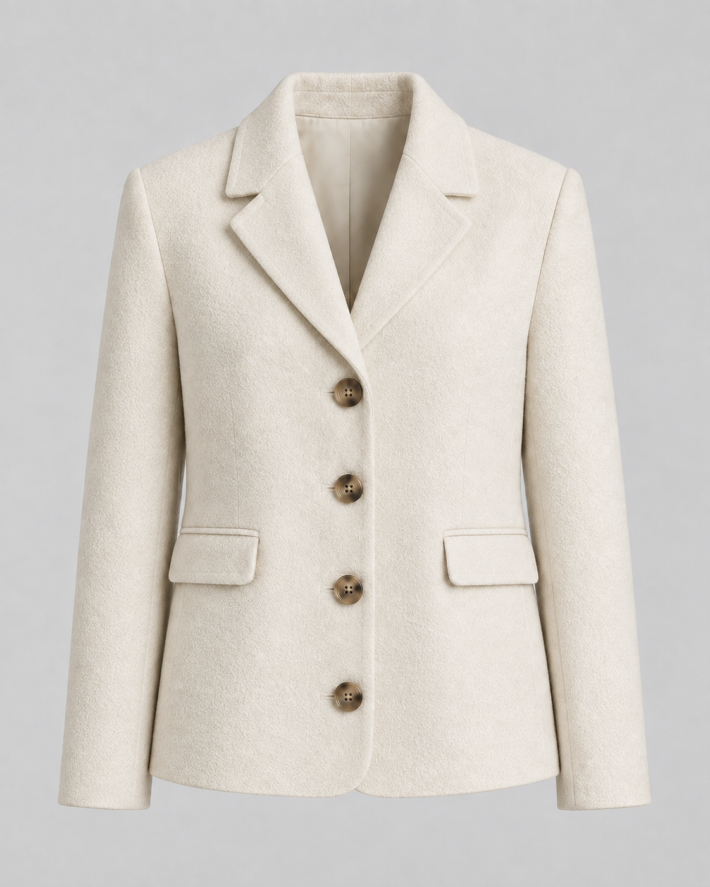
    </td>
    <td>
      
    </td>
  </tr>
</table>

AI Output 将前襟纽扣从 3 颗增加为 4 颗，改变了 Locked Feature，因此被直接标记为 `REJECT`。校正版本恢复三颗纽扣后，才可重新进入 QC。

完整 QC 记录见 [`06_QC`](./06_QC/)。

## Multi-format Delivery

通过 QC 的源文件被重新构图并适配至不同商业渠道。适配过程不拉伸人物或商品，也不使用 REJECT 素材。

<table>
  <tr>
    <td width="50%">
      
    </td>
    <td width="50%">
      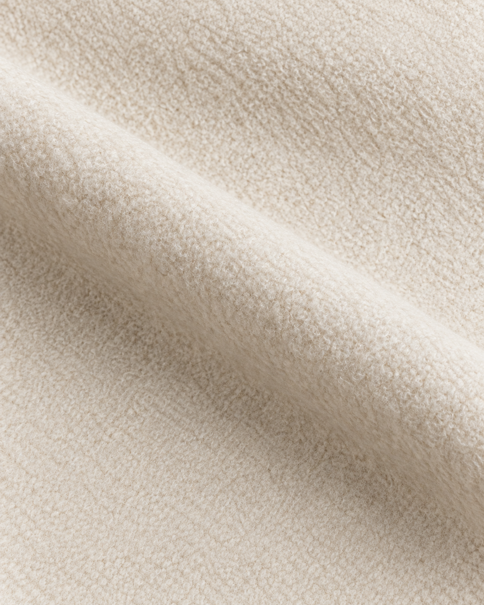
    </td>
  </tr>
  <tr>
    <td align="center">E-commerce PDP · 1:1</td>
    <td align="center">Social Media · 4:5</td>
  </tr>
  <tr>
    <td>
      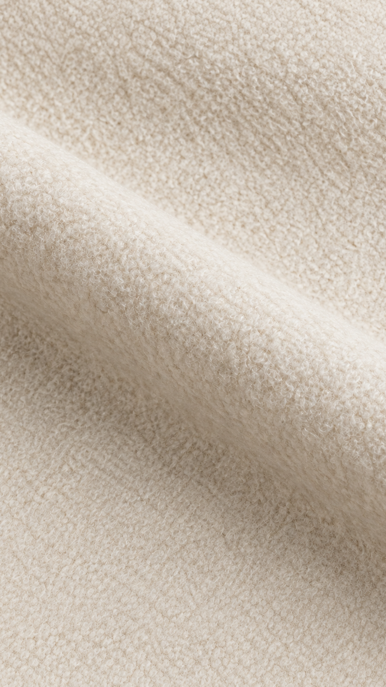
    </td>
    <td>
      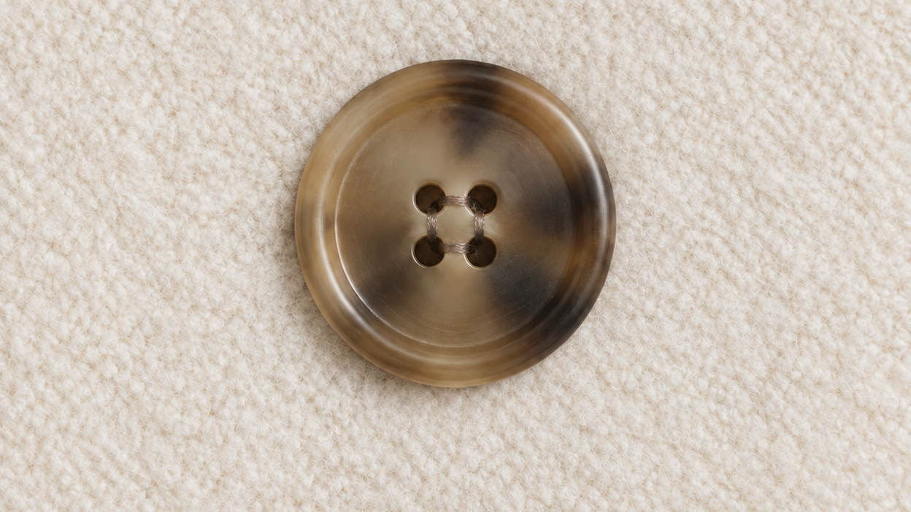
    </td>
  </tr>
  <tr>
    <td align="center">Mobile · 9:16</td>
    <td align="center">Campaign Banner · 16:9</td>
  </tr>
</table>

交付系统覆盖：

| Ratio | Commercial Use |
|---|---|
| 1:1 | E-commerce PDP |
| 3:4 | Product Image |
| 4:5 | Social Media |
| 9:16 | Mobile / Story |
| 16:9 | Campaign / Desktop |

所有尺寸优先使用 Cropping 和 Reframing，保持商品颜色、纹理尺度和结构不变。

## Role & Tools

### Role

**Visual Direction · AI Production Workflow · Prompt / Reference Control · Product Consistency · Visual QC · Commercial Delivery**

我负责将 Ground Truth 转化为可执行的商品规范，控制生成与修图边界，筛选 PASS 资产，识别结构性错误，并完成多渠道视觉交付。

### Tools

- **OpenAI ImageGen** — Reference-led Generation 与 Controlled Editing
- **Codex** — Production Workflow、资产组织、QC 记录与验证
- **HTML / CSS / JavaScript** — 响应式 Portfolio Website
- **PowerShell / .NET Imaging Utilities** — 裁切、尺寸检查与素材验证
- **Git / GitHub** — 版本管理与仓库展示

## Links

- [View Live Portfolio](https://commercial-visual-production.prime-coati-6409.chatgpt.site)
- [View Case Study](./08_CASE_STUDY/PAGE_PLAN.md)
- [View Product Specification](./PRODUCT_SPEC.md)
- [View Final QC Report](./06_QC/REPAIR_QC_REPORT_2026-09-21.md)
